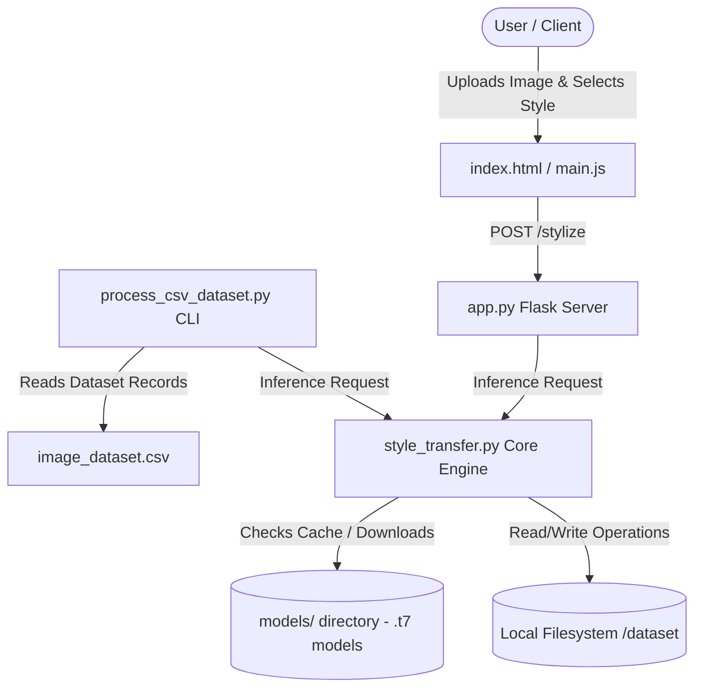

# 🎨 ImageToArt: Neural Style Transfer Platform

An AI-powered computer vision application that transforms standard photographs into stunning, stylized pieces of art using Fast Neural Style Transfer. The project features both an interactive, modern **Web Interface** (built with Flask, Tailwind CSS, and Glassmorphism design principles) and a high-performance **Batch CLI Processing Pipeline** for processing image datasets via CSV configurations.

---

## 🏛️ Project Architecture & Components

The system is designed with a modular separation of concerns between the core machine learning inference engine, the web server/API layer, and the batch processing scripts.



### File Hierarchy
*   **[app.py](file:///c:/Users/prins/OneDrive/Desktop/image-to-art/app.py)**: The web server handler. Configures Flask app settings (upload sizes, destination directories), serves the browser UI, downloads models dynamically, and handles the asynchronous `/stylize` endpoint.
*   **[style_transfer.py](file:///c:/Users/prins/OneDrive/Desktop/image-to-art/style_transfer.py)**: The central ML engine. Encapsulates OpenCV DNN loading, input scaling, image-to-blob normalization, feed-forward inference, and channel correction/saving.
*   **[csv_data_processing/](file:///c:/Users/prins/OneDrive/Desktop/image-to-art/csv_data_processing)**:
    *   **[process_csv_dataset.py](file:///c:/Users/prins/OneDrive/Desktop/image-to-art/csv_data_processing/process_csv_dataset.py)**: Iterates over the entries in `image_dataset.csv` to run batch stylization.
    *   **`image_dataset.csv`**: Contains rows defining `image_id`, local input image paths (`image_url`), descriptions, and target `style_model`.
*   **[templates/index.html](file:///c:/Users/prins/OneDrive/Desktop/image-to-art/templates/index.html)**: Handcrafted frontend template utilizing Tailwind CSS and glassmorphic aesthetic design details.
*   **[static/js/main.js](file:///c:/Users/prins/OneDrive/Desktop/image-to-art/static/js/main.js)**: Handles drag-and-drop events, local FileReader previewing, asynchronous AJAX uploads, error states, and downloading logic.

---

## 🧠 Machine Learning Engine (Under the Hood)

The project leverages **Fast Neural Style Transfer** (Johnson et al.), which replaces slow iterative style optimization with a feed-forward neural network. We load pre-trained PyTorch/Torch weights (`.t7` format) and run inference directly through OpenCV's Deep Neural Network (`cv2.dnn`) module without requiring a GPU.

### The Inference Lifecycle:
1.  **Model Loading**:
    Loads Torch network weights into memory using OpenCV:
    ```python
    net = cv2.dnn.readNetFromTorch(model_path)
    ```
2.  **Adaptive Image Scaling**:
    To prevent out-of-memory errors and optimize CPU execution times, the image is resized to fit within a $600\text{px} \times 600\text{px}$ bounding box while preserving its original aspect ratio:
    ```python
    scale = 600.0 / max(h, w)
    if scale < 1.0:
        image = cv2.resize(image, None, fx=scale, fy=scale)
    ```
3.  **Blob Conversion & Channel Normalization**:
    Neural networks expect floating-point inputs in a specific structure. `cv2.dnn.blobFromImage` transforms the standard image array into a 4D tensor. It performs BGR channel mean subtraction using ImageNet training averages:
    *   Mean Red subtracted: `123.680`
    *   Mean Green subtracted: `116.779`
    *   Mean Blue subtracted: `103.939`
4.  **Forward Pass**:
    The input blob is sent through the convolutional neural layers:
    ```python
    net.setInput(blob)
    output = net.forward()
    ```
5.  **Post-Processing**:
    The tensor is reshaped back to a standard shape. The average ImageNet channel means are added back to restore brightness, and values are normalized to a standard integer color space `[0, 255]`:
    ```python
    output = output.reshape((3, output.shape[2], output.shape[3]))
    output[0] += 103.939  # Blue Mean
    output[1] += 116.779  # Green Mean
    output[2] += 123.680  # Red Mean
    output = output.transpose(1, 2, 0)
    output = cv2.normalize(output, None, 0, 255, cv2.NORM_MINMAX, dtype=cv2.CV_8U)
    ```

---

## ⚙️ Setup and Installation

### Prerequisites
Make sure you have Python 3.8+ installed on your machine.

### Installation Steps

1.  **Clone / Navigate** to your project directory.
2.  **Create and Activate a Virtual Environment**:
    *   **Windows**:
        ```bash
        python -m venv venv
        venv\Scripts\activate
        ```
    *   **macOS/Linux**:
        ```bash
        python3 -m venv venv
        source venv/bin/activate
        ```
3.  **Install Required Dependencies**:
    ```bash
    pip install -r requirements.txt
    ```

---

## 🚀 How to Run the Project

### 1. The Interactive Web Platform
Launch the Flask development server:
```bash
python app.py
```
Open your browser and navigate to `http://127.0.0.1:5000/`.

*   **Drag and drop** or browse to select your source photo.
*   Select an artistic style from the dropdown.
*   Click **Stylize Image** to trigger the API. The system dynamically downloads the chosen neural network model if it isn't already cached locally.
*   Once finished, view your original alongside your masterpiece, and click **Download Art** to save your new artwork.

### 2. The Batch CLI Dataset Processor
To process a pre-configured list of images automatically:
```bash
python csv_data_processing/process_csv_dataset.py
```
*   This script reads data from `csv_data_processing/image_dataset.csv`.
*   It loads the specified local images, downloads the chosen style models, processes them sequentially, and saves all outputs inside `dataset/csv_output/`.
*   Upon completion, it prints a performance report detailing the total time, average speed per image, and processing status.

### 3. Single-Image Terminal Mode
You can also run style transfer on a single image via the CLI using:
```bash
python style_transfer.py <path_to_image> [model.t7]
```
*(Example: `python style_transfer.py dataset/input/my_photo.jpg starry_night.t7`)*
